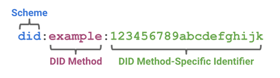
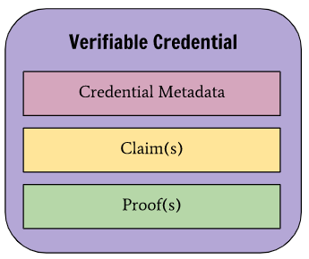
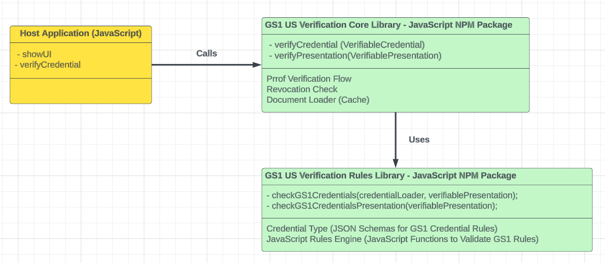

# Overview 
The GS1 US Decentralized Identifier & Verifiable Credentials solution has been created to provide guidance on how to verify Verifiable Credentials (VC) issued for the GS1 Verifiable Credentials Digital License ecosystem.

The GS1 License ecosystem ensures globally unique identification of products, asserts, locations, and entities for global trade. The GS1 Digital license ecosystem expresses existing licenses as W3C verifiable credentials. By assembling a chain of these credentials, product, location, and asset assertions can be digitally verified as authentic. This library supports the validation of these credentials chains.

Currently this solution is built for the [WC3 Verifiable Credentials Data Model 1.1](https://www.w3.org/TR/vc-data-model) and the GS1 level four validation rules defined in the [GS1 Data Model](https://ref.gs1.org/gs1/vc/data-model/) to validate the root of trust with GS1 issued credentials.

The GS1 US Verifiable Credentials Verification solution is divided into two libraries. 

- [vc-verifier-core](https://github.com/gs1us-technology/vc-verifier-core): This is the core library for verifying GS1 US Based Verifiable Credentials. This library is the main library to use for verifying VCs. The library will perform proof and revocation checks on all presented VCs. 
- [vc-verifier-rules](https://github.com/gs1us-technology/vc-verifier-rules): This is the rules library for verifying GS1 US Based Verifiable Credentials. This library will validate GS1 based VCs and ensure they follow the level four business rules defined by the GS1 Data Model Document. 

**Notes**: To run the libraries locally you will need to clone both repos into a parent Folder (e.g. gs1-us). The vc-verifier-core library has a dependency on the vc-verifier-rules and requires running a local NPM Install. 

See the using the library section for more details. 

# Understanding Decentralized Identifiers
## What is a DID
Decentralized identifiers (DIDs) are a new type of identifier that enables verifiable, decentralized digital identity. A DID identifies any subject (e.g., a person, organization, thing, data model, abstract entity, etc.) that the controller of the DID decides that it identifies.

A DID is a simple text string consisting of three parts: 1) the did URI scheme identifier, 2) the identifier for the DID method, and 3) the DID method-specific identifier.



## DID Methods
There are many different types of DID methods. Each method requires a defined method specification, which specifies the precise operations by which DIDs and DID documents are created, resolved, updated, and deactivate.

DID methods are often associated with a particular verifiable data registry (e.g. blockchain) or in cases like did:web use existing web infrastructure to store and support the resolution of DID documents.

The GS1 US Decentralized Identifier & Verifiable Credentials solution currently only supports DID:WEB and DID:KEY based DID Documents. To resolve a DID and get its DID Document you can use the [DID Universal Resolver](https://dev.uniresolver.io). 

The two main DID Documents used by this library are the GS1 Global DID (did:web:id.gs1.org) and the GS1 US DID (did:web:cbpvsvip-vc.gs1us.org).

Here is the DID Document for the GS1 US DID. The key components of the DID Document are the verificationMethod which is contains the public key which is required to verify Verifiable Credentials issued by the GS1 US DID. 
``` JSON
{
  "@context": [
    "https://www.w3.org/ns/did/v1",
    "https://w3id.org/security/suites/ed25519-2020/v1",
    "https://w3id.org/security/suites/x25519-2020/v1",
    "https://w3id.org/security/suites/ed25519-2018/v1"
  ],
  "id": "did:web:cbpvsvip-vc.gs1us.org",
  "verificationMethod": [
    {
      "id": "did:web:cbpvsvip-vc.gs1us.org#z6Mkig1nTEAxna86Pjb71SZdbX3jEdKRqG1krDdKDatiHVxt",
      "type": "Ed25519VerificationKey2020",
      "controller": "did:web:cbpvsvip-vc.gs1us.org",
      "publicKeyMultibase": "z6Mkig1nTEAxna86Pjb71SZdbX3jEdKRqG1krDdKDatiHVxt"
    },
    {
      "id": "did:web:cbpvsvip-vc.gs1us.org#5yYxa2LAQCkNA8BDEkhtgDEoPNeJhHUmsQBvzATvRZrc",
      "type": "Ed25519VerificationKey2018",
      "controller": "did:web:cbpvsvip-vc.gs1us.org",
      "publicKeyBase58": "5yYxa2LAQCkNA8BDEkhtgDEoPNeJhHUmsQBvzATvRZrc"
    }
  ],
  "authentication": [
    "did:web:cbpvsvip-vc.gs1us.org#z6Mkig1nTEAxna86Pjb71SZdbX3jEdKRqG1krDdKDatiHVxt",
    "did:web:cbpvsvip-vc.gs1us.org#5yYxa2LAQCkNA8BDEkhtgDEoPNeJhHUmsQBvzATvRZrc"
  ],
  "assertionMethod": [
    "did:web:cbpvsvip-vc.gs1us.org#z6Mkig1nTEAxna86Pjb71SZdbX3jEdKRqG1krDdKDatiHVxt",
    "did:web:cbpvsvip-vc.gs1us.org#5yYxa2LAQCkNA8BDEkhtgDEoPNeJhHUmsQBvzATvRZrc"
  ],
  "capabilityDelegation": [
    "did:web:cbpvsvip-vc.gs1us.org#z6Mkig1nTEAxna86Pjb71SZdbX3jEdKRqG1krDdKDatiHVxt",
    "did:web:cbpvsvip-vc.gs1us.org#5yYxa2LAQCkNA8BDEkhtgDEoPNeJhHUmsQBvzATvRZrc"
  ],
  "capabilityInvocation": [
    "did:web:cbpvsvip-vc.gs1us.org#z6Mkig1nTEAxna86Pjb71SZdbX3jEdKRqG1krDdKDatiHVxt",
    "did:web:cbpvsvip-vc.gs1us.org#5yYxa2LAQCkNA8BDEkhtgDEoPNeJhHUmsQBvzATvRZrc"
  ],
  "keyAgreement": [
    {
      "id": "did:web:cbpvsvip-vc.gs1us.org#z6LSeSb6DC38Qcwi5H3Rd24PfRL7rAe7wgUJ9feaickQuWx6",
      "type": "X25519KeyAgreementKey2020",
      "controller": "did:web:cbpvsvip-vc.gs1us.org",
      "publicKeyMultibase": "z6LSeSb6DC38Qcwi5H3Rd24PfRL7rAe7wgUJ9feaickQuWx6"
    }
  ],
  "publicKey": [
    {
      "@context": "https://w3id.org/security/v2",
      "id": "did:web:cbpvsvip-vc.gs1us.org#5yYxa2LAQCkNA8BDEkhtgDEoPNeJhHUmsQBvzATvRZrc",
      "type": "Ed25519VerificationKey2018",
      "publicKeyBase58": "5yYxa2LAQCkNA8BDEkhtgDEoPNeJhHUmsQBvzATvRZrc"
    },
    {
      "@context": "https://w3id.org/security/v2",
      "id": "did:web:cbpvsvip-vc.gs1us.org#z6Mkig1nTEAxna86Pjb71SZdbX3jEdKRqG1krDdKDatiHVxt",
      "type": "Ed25519VerificationKey2020",
      "controller": "did:web:cbpvsvip-vc.gs1us.org",
      "publicKeyMultibase": "z6Mkig1nTEAxna86Pjb71SZdbX3jEdKRqG1krDdKDatiHVxt"
    }
  ],
  "service": [
    {
      "id": "did:web:cbpvsvip-vc.gs1us.org#traceability-api",
      "type": [
        "TraceabilityAPI"
      ],
      "serviceEndpoint": "https://vc.cbpsvip.gs1us.org/cbpsvip"
    }
  ]
}
```

When a Verifiable Credential is issued the Public and Private key for the DID Document is used to generate a crypographic proof that is included in the signed Verifiable Credential. This proof is used during verification to identify 
the verificationMethod and associated public key to use to validate the Verifiable Credential.

The other main component from the DID Document is the services section. This section defines the different types of services supported by the DID. For the GS1 US DID, we support the Traceability API End Point. 

# Verifiable Credentials

## What is a Credential 

A credential is a set of one or more claims made by an issuer. A verifiable credential is a tamper-evident credential that has authorship that can be cryptographically verified. Verifiable credentials can be used to build verifiable presentations, which can also be cryptographically verified.



- Credential Metadata
  - Includes the unique ID of the credential, information about the subject or holder, information about the issuer, an expiration date, and the status of the credential
- Claims
  - Asserted properties or qualifications about the subject
  - There can one or more claims in a single VC
- Proofs
  - This is the cryptographic signature of the issuer
  - The verifier will used this information to verify the issuer signature and ensure the VC has not be altered.
  
## Example Verifiable Credential
``` JSON
{
  "@context": [
    "https://www.w3.org/2018/credentials/v1",
    "https://ref.gs1.org/gs1/vc/license-context",
    "https://w3id.org/security/suites/ed25519-2020/v1",
    {
      "name": "https://schema.org/name",
      "description": "https://schema.org/description",
      "image": "https://schema.org/image"
    },
    "https://w3id.org/vc-revocation-list-2020/v1"
  ],
  "issuer": "did:web:cbpvsvip-vc.gs1us.org",
  "name": "GS1 Company Prefix License",
  "issuanceDate": "2021-05-11T10:50:36.701Z",
  "id": "http://did-vc.gs1us.org/vc/license/08600057694",
  "type": [
    "VerifiableCredential",
    "GS1CompanyPrefixLicenseCredential"
  ],
  "credentialSubject": {
    "id": "did:key:z6Mkfb3kW3kBP4UGqaBEQoCLBUJjdzuuuPsmdJ2LcPMvUreS/1",
    "organization": {
      "gs1:partyGLN": "0860005769407",
      "gs1:organizationName": "Healthy Tots"
    },
    "extendsCredential": "https://id.gs1.org/vc/license/gs1_prefix/08",
    "licenseValue": "08600057694",
    "alternativeLicenseValue": "8600057694"
  },
  "credentialStatus": {
    "id": "https://cbpvsvip-vc.dev.gs1us.org/status/2c0a1f02-d545-481b-902a-1e919cd706e2/1193",
    "type": "RevocationList2020Status",
    "revocationListIndex": 1193,
    "revocationListCredential": "https://cbpvsvip-vc.dev.gs1us.org/status/2c0a1f02-d545-481b-902a-1e919cd706e2/"
  },
  "proof": {
    "type": "Ed25519Signature2020",
    "created": "2023-05-22T16:55:59Z",
    "verificationMethod": "did:web:cbpvsvip-vc.gs1us.org#z6Mkig1nTEAxna86Pjb71SZdbX3jEdKRqG1krDdKDatiHVxt",
    "proofPurpose": "assertionMethod",
    "proofValue": "zfWTiZ9CRLJBUUHRFa82adMZFwiAvYCsTwRjX7JaTpUnVuCTj44f9ErSGbTBWezv89MyKQ3jTLFgWUbUvB6nuJCN"
  }
}
```

# Library Runtime

The library is a JavaScript ES Module (EMS) based NPM package that uses the WC3 standards VC libraries provided by Digital Bazaar. To consume the library directly you can **Import** any of the Functions or Types exported by the libraries src/index.ts file. 

The library requires the following environment:
- Node - v18.16.1+
- NPM - 9.5.1+

# Repo Folders
- `public`: Sample and Test Credentials used by the library. 
- `src\contexts`: JSON-LD and DID Documents required by the library including the standard WC3 JSON-LD files, the GS1 Data Model JSON-LD files, and other dependent 
- `src\lib`: The main code for the GS1 US vc-verifier-core JavaScript library.
 - `src\tests\index-test.ts`: Test Suite for testing the library

# Running the Library Locally 
To use the GS1 US Decentralized Identifier & Verifiable Credentials solution you will need to clone both the [vc-verifier-core](https://github.com/gs1us-technology/vc-verifier-core) and [vc-verifier-rules](https://github.com/gs1us-technology/vc-verifier-rules) libraries. 

After cloning both libraries open the `vc-verifier-rules` library and perform the following steps from the top folder for vc-verifier-rules.
``` 
npm install
npm run dev
``` 

The  `npm run dev` command will compile the library into it's dist folder. This is a prerequisite before running the `vc-verifier-core` library. Now, load the `vc-verifier-core` library and preform the following steps.

``` 
npm install
npm install  ../vc-verifier-rules
npm run dev
``` 
Note: `npm install ../vc-verifier-rules` is required for loading the `vc-verifier-rules` project into the `vc-verifier-core` node modules folder. 

Now that both libraries are setup and running locally from the top level command line for `vc-verifier-core` running the following to execute the libraries test suite.

``` 
node .
``` 

# Testing the Library
The `vc-verifier-core` library includes a number of integration tests to validate different verifiable credentials scenarios. These include tests focus on proof verification, revocation status checking, and GS1 based credential validation. 

The following are two verification scenarios include with the library. To see all the test scenarios review the `src\tests\index-test.ts` file.

## Organization Verifiable Credential
Validate the GS1 credential chain starting with a GS1 Organization, it's associated Key credential and Company Prefix credential. During this validation a GS1 License Prefix credential issued by GS1 Global will be resolved. This is done to validate the complete root of trust for GS1 issued credentials.

``` 
node . -test organization
``` 

Output From Tests: 

The presentation submitted has passed all three types of verification. Inside of the `credentialResults` array there will be an item for each verifiable credential included within the presentation. 

``` 
{
  "verified": true,
  "result": {
    "verified": true,
    "verifications": [
      {
        "title": "Proof",
        "status": "good"
      },
      {
        "title": "Revocation",
        "status": "good"
      },
      {
        "title": "GS1CredentialValidation",
        "status": "good"
      }
    ],
    "credentialResults": [
      {
        "verified": true,
        "credentialId": "http://did-vc.gs1us.org/vc/license/08600057694",
        "credentialName": "GS1CompanyPrefixLicenseCredential",
        "credentialValidationRules": [
          {
            "code": "VS-100",
            "rule": "Verification Status",
            "isValid": true
          }
        ]
      },
      {
        "verified": true,
        "credentialId": "did:key:z6MkrSXAsv2UTtNp3eZv8ypKNupbpYEqmBxpqDF994EhxQAk",
        "credentialName": "KeyCredential",
        "credentialValidationRules": [
          {
            "code": "VS-100",
            "rule": "Verification Status",
            "isValid": true
          }
        ]
      },
      {
        "verified": true,
        "credentialId": "did:key:z6Mkp5zGya5YjRVdAk4iu9vGb29Cy67gZ6YwCxMH8scsLRbq",
        "credentialName": "OrganizationDataCredential",
        "credentialValidationRules": [
          {
            "code": "VS-100",
            "rule": "Verification Status",
            "isValid": true
          }
        ]
      }
    ]
  }
}
``` 

## Verifiable Credential That Fails Validation
Validate the GS1 credential chain starting with a GS1 Product Data Credential, it's associated Key credential and Company Prefix credential. During this validation a GS1 License Prefix credential issued by GS1 Global will be resolved. This is done to validate the complete root of trust for GS1 issued credentials.

This test scenario has been setup to fail one of the GS1 Credential validation rules. 

``` 
node . -test gs1_validation_chain_error
``` 

Output From Tests: 

The presentation submitted includes a verifiable Credential that fails one of the GS1 Credential validation rules. The overall verified status for the presentation will return false. Inside of the result property you should see that the Proof and Revocation Checks pass. However, the GS1CredentialValidation has failed. To see the failure review the `credentialResults` array. The verifiable credentials that failed validation will have a verified status of `false` and include one or more credential validation rules errors. 

``` 
{
  "verified": false,
  "result": {
    "verified": false,
    "verifications": [
      {
        "title": "Proof",
        "status": "good"
      },
      {
        "title": "Revocation",
        "status": "good"
      },
      {
        "title": "GS1CredentialValidation",
        "status": "bad"
      }
    ],
    "credentialResults": [
      {
        "verified": true,
        "credentialId": "http://did-vc.gs1us.org/vc/license/08600057694",
        "credentialName": "GS1CompanyPrefixLicenseCredential",
        "credentialValidationRules": [
          {
            "code": "VS-100",
            "rule": "Verification Status",
            "isValid": true
          }
        ]
      },
      {
        "verified": true,
        "credentialId": "did:key:z6MknHepGrjA2LnaxMw3yDp9SRYryLRKQ7GUMpFusYfwSdyW",
        "credentialName": "KeyCredential",
        "credentialValidationRules": [
          {
            "code": "VS-100",
            "rule": "Verification Status",
            "isValid": true
          }
        ]
      },
      {
        "verified": false,
        "credentialId": "did:key:z6MkumEzsmdv1ywQ5vHZ4LjgLZvR8jpofr46gipxUqxokvrT",
        "credentialName": "ProductDataCredential",
        "credentialValidationRules": [
          {
            "code": "VS-100",
            "rule": "Verification Status",
            "isValid": true
          },
          {
            "code": "GS1-320",
            "rule": "The data credential GS1 Digital Link does not match the Id in the Key Credential."
          }
        ]
      }
    ]
  }
}
``` 
## Test Command Line Options
The integration test suite for the `vc-verifier-core` library includes a number of command line switches to make it easier to run different tests. 

Test Suite Command Line Options
- `node .`  Will run all the standard tests
- `node . -all`  Will run all tests 
- `node . -test TEST_NAME`  Will run an individual test
- `node . -gs1`  Will run all the GS1 Credential Tests that pass validation
- `node . -gs1 -error`  Will run all the GS1 Credential Tests that fail validation

# Using the Library
To use the GS1 US Decentralized Identifier & Verifiable Credentials core and rules library in your own solution, you will need to do a local install of both libaries. 



After setting up your application run the following install comamnds. This will install the libraries and its dependencies into your local node_modules folder. 
``` JavaScript
npm install ../vc-verifier-rules
npm install ../vc-verifier-core
```
## Referencing the Library 
Add the following to reference the library in your local code. Take note you may have to add **// @ts-ignore** above the from. This is override for when the libraries TypeScript Types can not be imported correctly.

``` typescript
// @ts-ignore
import { verificationResult } from '@gs1us/vc-verifier-rules';

// @ts-ignore
import { VerifiableCredential, VerifiablePresentation, verificationResult } from '@gs1us/vc-verifier-rules'
``` 
## Library API
The library includes two methods for verifying credentials.
- `verifyPresentation` Is the main method and should be used when you have a signed presentation that contains the required GS1 credentials.
- `verifyCredential` Is an additional method that can be called when you only have a single verifiable credentials. Internally this method will generate an unsigned presentation before validating the credential.

## Code Example
Included below is an example of calling the `verifyPresentation` method in the library. This will verify all the verifiable credentials included in the presentation. After the proof and revocation checks are performed on the verifiable credentials any GS1 credential's included will be verified using the vc-verifier-rules library.

``` typescript
// See the index-test.ts file in the vc-verifier-core code base for how to load a verifiable credential/presentation from a local JSON File 
// Or provide your own verifiable credential/presentation to the verifyPresentation method. 
const testPresentation = getTestPresentation("company-prefix-product-data-00860005769421");
const vcResult: verificationResult = await verifyPresentation(testPresentation);

if (vcResult.verified === true) {
   console.log("Success");
} else {
  console.log(JSON.stringify(vcResult, null, 4));
```

## Library Output 
The following types are the main output from the @gs1us/vc-verifier-core library. Both the `verifyPresentation` and  `verifyCredential` will return a result object called `verificationResult` that contains the status of the verifiable credential: Proof, Revocation and where applicable GS1 Credential validation status. 

Check the `verified` property of the return result. If true all the verifiable credentials passed to the library pass all levels of validation. If false one or more of the verifiable credentials could not be validated. When that happens check the `credentialValidationRules` property for any validation errors encountered during verification. 

``` typescript
// *****  Validation Rule Checks *****
export type verificationCheck = {
    status: "good" | "bad";
    title: "Proof" | "Activation" | "Expired" | "Revocation" | "GS1CredentialValidation";
}

// Code and Rule Associated with GS1 Validation Rules - See lib/engine/gs1-credential-errors.ts for list of codes
export type gs1CredentialValidationRule = {
    code: string;
    rule: string;
}

// *****  Verification Library Result Objects *****
export type credentialResults = {
    verified: boolean, 
    credentialId: string,
    credentialValidationRules?: gs1CredentialValidationRule[];
}

export type verificationResult = {
    verified: boolean;
    verifications?: verificationCheck[];
    credentialResults?: credentialResults[];
}
```
# Contribute
This library is currently not supporting external PRs. If you run into an issue or have a suggest please post in the repo's issue board. 

# License
Copyright 2023 GS1 US

Licensed under the Apache License, Version 2.0 (the "License");
you may not use this file except in compliance with the License.
You may obtain a copy of the License at

    http://www.apache.org/licenses/LICENSE-2.0

Unless required by applicable law or agreed to in writing, software
distributed under the License is distributed on an "AS IS" BASIS,
WITHOUT WARRANTIES OR CONDITIONS OF ANY KIND, either express or implied.
See the License for the specific language governing permissions and
limitations under the License.
