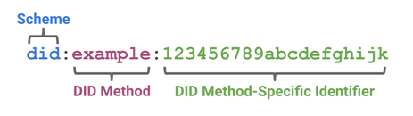
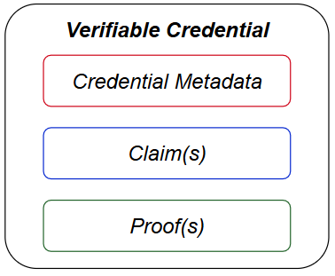

# Overview 
The GS1 US Decentralized Identifier & Verifiable Credentials solution has been created to provide guidance on how to verify Verifiable Credentials (VC) issued for the GS1 Verifiable Credentials Digital License ecosystem. The library is **FOR DEMONSTRATION PURPOSES ONLY: NOT TO BE USED FOR PRODUCTION GRADE SYSTEMS!**

The GS1 License ecosystem ensures globally unique identification of products, asserts, locations, and entities for global trade.  The GS1 Digital license ecosystem expresses existing licenses as W3C verifiable credentials.   By assembling a chain of these credentials, product, location, and asset assertions can be digitally verified as authentic.  This library supports the validation of these credentials chains.

This solutions support the [WC3 Verifiable Credentials Data Model 2.0](https://www.w3.org/TR/vc-data-model-2.0) and [WC3 Verifiable Credentials Data Model 1.1](https://www.w3.org/TR/vc-data-model) and the GS1 level four validation rules defined in the [GS1 Data Model](https://ref.gs1.org/gs1/vc/data-model/) to validate the root of trust with GS1 issued credentials.

The GS1 US Verifiable Credentials Verification solution is divided into two libraries. 

- [vc-verifier-core](https://github.com/gs1us-technology/vc-verifier-core): This is the core library for verifying GS1 US Based Verifiable Credentials. This library is the main library to use for verifying VCs. The library will perform proof and revocation checks on all presented VCs. 
- [vc-verifier-rules](https://github.com/gs1us-technology/vc-verifier-rules): This is the rules library for verifying GS1 US Based Verifiable Credentials. This library will validate GS1 based VCs and ensure they follow the level four business rules defined by the GS1 Data Model Document.

**Notes**: To run the libraries locally you will need to clone both repos into a parent Folder (e.g. gs1-us). The vc-verifier-core library has a dependency on the vc-verifier-rules and requires running a local NPM Install. 

See the using the library section for more details. 

# Understanding Decentralized Identifiers
## What is a DID
Decentralized identifiers (DIDs) are a new type of identifier that enables verifiable, decentralized digital identity. A DID identifies any subject (e.g., a person, organization, thing, data model, abstract entity, etc.) that the controller of the DID decides that it identifies.

A DID is a simple text string consisting of three parts: 1) the did URI scheme identifier, 2) the identifier for the DID method, and 3) the DID method-specific identifier.



## DID Methods
There are many different types of DID methods. Each method requires a defined method specification, which specifies the precise operations by which DIDs and DID documents are created, resolved, updated, and deactivate.

DID methods are often associated with a particular verifiable data registry (e.g. blockchain) or in cases like did:web use existing web infrastructure to store and support the resolution of DID documents.

The GS1 US Decentralized Identifier & Verifiable Credentials solution currently only supports DID:WEB and DID:KEY based DID Documents. To resolve a DID and get its DID Document you can use the [DID Universal Resolver](https://dev.uniresolver.io). 

The two main DID Documents used by this library are the GS1 Global DID (did:web:id.gs1.org) and the GS1 US DID (did:web:cbpvsvip-vc.gs1us.org).

Here is the DID Document for the GS1 US DID. The key components of the DID Document are the verificationMethod which is contains the public key which is required to verify Verifiable Credentials issued by the GS1 US DID. 
``` JSON
{
  "@context": [
    "https://www.w3.org/ns/did/v1",
    "https://w3id.org/security/suites/ed25519-2020/v1",
    "https://w3id.org/security/suites/x25519-2020/v1",
    "https://w3id.org/security/suites/ed25519-2018/v1",
    "https://w3id.org/security/jwk/v1"
  ],
  "id": "did:web:cbpvsvip-vc.gs1us.org",
  "verificationMethod": [
    {
      "id": "did:web:cbpvsvip-vc.gs1us.org#z6Mkig1nTEAxna86Pjb71SZdbX3jEdKRqG1krDdKDatiHVxt",
      "type": "Ed25519VerificationKey2020",
      "controller": "did:web:cbpvsvip-vc.gs1us.org",
      "publicKeyMultibase": "z6Mkig1nTEAxna86Pjb71SZdbX3jEdKRqG1krDdKDatiHVxt"
    },
    {
      "id": "did:web:cbpvsvip-vc.gs1us.org#5yYxa2LAQCkNA8BDEkhtgDEoPNeJhHUmsQBvzATvRZrc",
      "type": "Ed25519VerificationKey2018",
      "controller": "did:web:cbpvsvip-vc.gs1us.org",
      "publicKeyBase58": "5yYxa2LAQCkNA8BDEkhtgDEoPNeJhHUmsQBvzATvRZrc"
    },
    {
      "id": "did:web:cbpvsvip-vc.gs1us.org#Iyr0fwTvdlERk8EBXVuIs7682yn9djcBx6hGmzcaoas",
      "type": "JsonWebKey", 
      "controller": "did:web:cbpvsvip-vc.gs1us.org",
      "publicKeyJwk": {
        "kid": "Iyr0fwTvdlERk8EBXVuIs7682yn9djcBx6hGmzcaoas",
        "alg": "ES256",
        "kty": "EC",
        "crv": "P-256",
        "x": "hBF7Hxah_pA0FXenFvNv88KCy8CUZ4dliM55Y-GM-Bw",
        "y": "tPtg-vqFDABNv7G_XZqeYZkfY9gJE-30PONnS8FAIVs"
      }
    }
  ],
  "authentication": [
    "did:web:cbpvsvip-vc.gs1us.org#z6Mkig1nTEAxna86Pjb71SZdbX3jEdKRqG1krDdKDatiHVxt",
    "did:web:cbpvsvip-vc.gs1us.org#5yYxa2LAQCkNA8BDEkhtgDEoPNeJhHUmsQBvzATvRZrc",
    "did:web:cbpvsvip-vc.gs1us.org#Iyr0fwTvdlERk8EBXVuIs7682yn9djcBx6hGmzcaoas"
  ],
  "assertionMethod": [
    "did:web:cbpvsvip-vc.gs1us.org#z6Mkig1nTEAxna86Pjb71SZdbX3jEdKRqG1krDdKDatiHVxt",
    "did:web:cbpvsvip-vc.gs1us.org#5yYxa2LAQCkNA8BDEkhtgDEoPNeJhHUmsQBvzATvRZrc",
    "did:web:cbpvsvip-vc.gs1us.org#Iyr0fwTvdlERk8EBXVuIs7682yn9djcBx6hGmzcaoas"
  ],
  "capabilityDelegation": [
    "did:web:cbpvsvip-vc.gs1us.org#z6Mkig1nTEAxna86Pjb71SZdbX3jEdKRqG1krDdKDatiHVxt",
    "did:web:cbpvsvip-vc.gs1us.org#5yYxa2LAQCkNA8BDEkhtgDEoPNeJhHUmsQBvzATvRZrc",
    "did:web:cbpvsvip-vc.gs1us.org#Iyr0fwTvdlERk8EBXVuIs7682yn9djcBx6hGmzcaoas"
  ],
  "capabilityInvocation": [
    "did:web:cbpvsvip-vc.gs1us.org#z6Mkig1nTEAxna86Pjb71SZdbX3jEdKRqG1krDdKDatiHVxt",
    "did:web:cbpvsvip-vc.gs1us.org#5yYxa2LAQCkNA8BDEkhtgDEoPNeJhHUmsQBvzATvRZrc",
    "did:web:cbpvsvip-vc.gs1us.org#Iyr0fwTvdlERk8EBXVuIs7682yn9djcBx6hGmzcaoas"
  ],
  "keyAgreement": [
    {
      "id": "did:web:cbpvsvip-vc.gs1us.org#z6LSeSb6DC38Qcwi5H3Rd24PfRL7rAe7wgUJ9feaickQuWx6",
      "type": "X25519KeyAgreementKey2020",
      "controller": "did:web:cbpvsvip-vc.gs1us.org",
      "publicKeyMultibase": "z6LSeSb6DC38Qcwi5H3Rd24PfRL7rAe7wgUJ9feaickQuWx6"
    }
  ],
  "publicKey": [
    {
      "@context": "https://w3id.org/security/v2",
      "id": "did:web:cbpvsvip-vc.gs1us.org#5yYxa2LAQCkNA8BDEkhtgDEoPNeJhHUmsQBvzATvRZrc",
      "type": "Ed25519VerificationKey2018",
      "publicKeyBase58": "5yYxa2LAQCkNA8BDEkhtgDEoPNeJhHUmsQBvzATvRZrc"
    },
    {
      "@context": "https://w3id.org/security/v2",
      "id": "did:web:cbpvsvip-vc.gs1us.org#z6Mkig1nTEAxna86Pjb71SZdbX3jEdKRqG1krDdKDatiHVxt",
      "type": "Ed25519VerificationKey2020",
      "controller": "did:web:cbpvsvip-vc.gs1us.org",
      "publicKeyMultibase": "z6Mkig1nTEAxna86Pjb71SZdbX3jEdKRqG1krDdKDatiHVxt"
    }
  ],
  "service": [
    {
      "id": "did:web:cbpvsvip-vc.gs1us.org#traceability-api",
      "type": [
        "TraceabilityAPI"
      ],
      "serviceEndpoint": "https://vc.cbpsvip.gs1us.org/cbpsvip"
    }
  ]
}
```

When a Verifiable Credential is issued the Public and Private key for the DID Document is used to generate a crypographic proof that is included in the signed Verifiable Credential. This proof is used during verification to identify the verificationMethod and associated public key to use to validate the Verifiable Credential.

The other main component from the DID Document is the services section. This section defines the different types of services supported by the DID. For the GS1 US DID, we support the Traceability API End Point. 

# Verifiable Credentials

## What is a Credential 

A credential is a set of one or more claims made by the same entity. Credentials might also include an identifier and metadata to describe properties of the credential, such as the issuer, the validity date and time period, a representative image, verification material, status information, and so on. A verifiable credential is a set of tamper-evident claims and metadata that cryptographically prove who issued it. Examples of verifiable credentials include, but are not limited to, digital employee identification cards, digital driver's licenses, and digital educational certificates.



- Credential Metadata
  - Includes the unique ID of the credential, information about the subject or holder, information about the issuer, an expiration date, and the status of the credential
- Claims
  - Asserted properties or qualifications about the subject
  - There can one or more claims in a single VC
- Proofs
  - This is the cryptographic signature of the issuer
  - The verifier will used this information to verify the issuer signature and ensure the VC has not be altered.

The [Verifiable Credentials Data Model v2.0](https://www.w3.org/TR/vc-data-model-2.0/) supports two classes of securing mechanisms: 

- An *enveloping proof* wraps a serialization of this data model. This library supports the JOSE (JWT) serialization method from the [Securing Verifiable Credentials using JOSE and COSE](https://www.w3.org/TR/vc-jose-cose/).

- An *embedded proof* is a mechanism where the proof is included in the serialization of the data model. This library supports the older [WC3 Verifiable Credentials Data Model 1.1 Linked Data Signature proof](https://www.w3.org/TR/vc-data-model/).

## Example Decoded JOSE Verifiable Credential
``` JSON

 // JOSE Header
 {
  "kid": "did:web:cbpvsvip-vc.gs1us.org#Iyr0fwTvdlERk8EBXVuIs7682yn9djcBx6hGmzcaoas",
  "alg": "ES256"
}

// JOSE Payload
{
  "@context": [
    "https://www.w3.org/ns/credentials/v2",
    "https://ref.gs1.org/gs1/vc/license-context"
  ],
  "id": "https://cbpvsvip-vc-api.gs1us.org/credentials/081015955",
  "type": [
    "VerifiableCredential",
    "GS1CompanyPrefixLicenseCredential"
  ],
  "issuer": {
    "id": "did:web:cbpvsvip-vc.gs1us.org",
    "name": "GS1 US"
  },
  "name": "GS1 Company Prefix License",
  "description": "THIS GS1 DIGITAL LICENSE CREDENTIAL IS FOR TESTING PURPOSES ONLY. A GS1 Company Prefix License is issued by a GS1 Member Organization or GS1 Global Office and allocated to a user company or to itself for the purpose of generating tier 1 GS1 identification keys.",
  "validFrom": "2024-01-25T12:30:00.000Z",
  "credentialSubject": {
    "id": "did:web:healthytots.net",
    "organization": {
      "gs1:partyGLN": "0810159550000",
      "gs1:organizationName": "Healthy Tots"
    },
    "extendsCredential": "https://id.gs1.org/vc/license/gs1_prefix/08",
    "licenseValue": "081015955",
    "alternativeLicenseValue": "81015955"
  },
  "credentialSchema": {
    "id": "https://id.gs1.org/vc/schema/v1/companyprefix",
    "type": "JsonSchema"
  },
  "credentialStatus": {
    "id": "https://cbpvsvip-vc-api.gs1us.org/status/801c6cc6-4fc4-4aa3-a347-3b31a175ac14#10010",
    "type": "BitstringStatusListEntry",
    "statusPurpose": "revocation",
    "statusListIndex": "10010",
    "statusListCredential": "https://cbpvsvip-vc-api.gs1us.org/status/801c6cc6-4fc4-4aa3-a347-3b31a175ac14/"
  }
}
```

# Library Runtime
The library is a JavaScript ES Module (EMS) based NPM package that uses 3rd party libraries or the verification of WC3 Verifiable Credentials. The library is meant to be an example verification library to guide interested parties how to verify GS1 credentials. 

- Uses [Transmute JOSE-COSE Library](https://github.com/transmute-industries/verifiable-credentials) to verify VC Data Model 2.0 JOSE (JWT) verifiable credentials.
- Uses [Digital Bazaar vc.js Library](https://github.com/digitalbazaar/vc) to verify VC Data Model 1.1 Data Integrity Proof verifiable credentials.

The library requires the following environment:
- Node - v18.20.4+
- NPM - v10.7.0+

# Repo Folders
- `public\data-integrity`: Older Data Integrity Sample and Test Credentials used by the library. 
- `public\jose`: JOSE Encoded Sample and Test Credentials used by the library. 
- `public\schema`: Custom Json Schema Validation rules for GS1 Verifiable Credentials
- `src\contexts`: JSON-LD and DID Documents required by the library including the standard WC3 JSON-LD files, the GS1 Data Model JSON-LD files, and other dependent 
- `src\lib`: The main code for the GS1 US vc-verifier-core JavaScript library.
- `src\tests\index-test.ts`: Test Suite Harness for demonstrating how to verify verifiable credentials
- `src\tests\data-integrity\data-integrity-test`: Test Suite for Older Data Integrity proof verifiable credentials
- `src\tests\jose\jose-test.ts`: Test Suite for JOSE verifiable credentials

# Running the Library Locally 
To use the GS1 US Decentralized Identifier & Verifiable Credentials solution you will need to clone both the [vc-verifier-core](https://github.com/gs1us-technology/vc-verifier-core) and [vc-verifier-rules](https://github.com/gs1us-technology/vc-verifier-rules) libraries. 

After cloning both libraries open the `vc-verifier-rules` library and perform the following steps from the top folder for vc-verifier-rules.
``` 
npm install
npm run dev
``` 

The  `npm run dev` command will compile the library into it's dist folder. This is a prerequisite before running the `vc-verifier-core` library. Now, load the `vc-verifier-core` library and preform the following steps.

``` 
npm install
npm install  ../vc-verifier-rules
npm run dev
``` 
Note: `npm install ../vc-verifier-rules` is required for loading the `vc-verifier-rules` project into the `vc-verifier-core` node modules folder. 

Now that both libraries are setup and running locally from the top level command line for `vc-verifier-core` running the following to execute the libraries test suite.

``` 
node .
``` 

# Testing the Library
The `vc-verifier-core` library includes a number of integration tests to validate different verifiable credentials scenarios. These include tests focus on proof verification, revocation status checking, and GS1 based credential validation. 

The following are two verification scenarios include with the library. To see all the test scenarios review the test files under the `src\tests\` folder.

## Organization Verifiable Credential
Validate the GS1 credential chain starting with a GS1 Organization, it's associated Key credential and Company Prefix credential. During this validation a GS1 License Prefix credential issued by GS1 Global will be resolved. This is done to validate the complete root of trust for GS1 issued credentials.

``` 
node . -test organization
``` 

Output From Tests: 

The presentation submitted has passed all four types of verification. Inside of the `credentialResults` array there will be an item for each verifiable credential included within the presentation. 

``` 
{
    "verified": true,
    "result": {
        "verified": true,
        "verifications": [
            {
                "title": "Proof",
                "status": "good"
            },
            {
                "title": "Revocation",
                "status": "good"
            },
            {
                "title": "JsonSchema",
                "status": "good"
            },
            {
                "title": "GS1CredentialValidation",
                "status": "good"
            }
        ],
        "credentialResults": [
            {
                "verified": true,
                "credentialId": "https://cbpvsvip-vc-api.gs1us.org/credentials/081015955",
                "credentialName": "GS1CompanyPrefixLicenseCredential",
                "credentialValidationRules": [
                    {
                        "code": "VS-100",
                        "rule": "Verifiable Credential Status Check is Successful."
                    },
                    {
                        "code": "VS-500",
                        "rule": "Verifiable Credential Schema Check is Successful."
                    }
                ],
                "error": []
            },
            {
                "verified": true,
                "credentialId": "did:key:z6MkrSXAsv2UTtNp3eZv8ypKNupbpYEqmBxpqDF994EhxQAk",
                "credentialName": "KeyCredential",
                "credentialValidationRules": [
                    {
                        "code": "VS-100",
                        "rule": "Verifiable Credential Status Check is Successful."
                    },
                    {
                        "code": "VS-500",
                        "rule": "Verifiable Credential Schema Check is Successful."
                    }
                ],
                "error": []
            },
            {
                "verified": true,
                "credentialId": "did:key:z6Mkp5zGya5YjRVdAk4iu9vGb29Cy67gZ6YwCxMH8scsLRbq",
                "credentialName": "OrganizationDataCredential",
                "credentialValidationRules": [
                    {
                        "code": "VS-100",
                        "rule": "Verifiable Credential Status Check is Successful."
                    },
                    {
                        "code": "VS-500",
                        "rule": "Verifiable Credential Schema Check is Successful."
                    }
                ],
                "error": []
            },
            {
                "verified": true,
                "credentialId": "https://id.gs1.org/vc/license/gs1_prefix/08",
                "credentialName": "GS1PrefixLicenseCredential",
                "credentialValidationRules": [],
                "error": []
            }
        ]
    }
}
``` 

## Verifiable Credential That Fails Validation
Validate the GS1 credential chain starting with a GS1 Product Data Credential, it's associated Key credential and Company Prefix credential. During this validation a GS1 License Prefix credential issued by GS1 Global will be resolved. This is done to validate the complete root of trust for GS1 issued credentials.

This test scenario has been setup to fail one of the GS1 Credential validation rules. 

``` 
node . -test gs1_validation_chain_error
``` 

Output From Tests: 

The presentation submitted includes a verifiable Credential that fails one of the GS1 Credential validation rules. The overall verified status for the presentation will return false. Inside of the result property you should see that the Proof and Revocation Checks pass. However, the GS1CredentialValidation has failed. To see the failure review the `credentialResults` array. The verifiable credentials that failed validation will have a verified status of `false` and include one or more credential validation rules errors. 

``` 
{
    "verified": false,
    "result": {
        "verified": false,
        "verifications": [
            {
                "title": "Proof",
                "status": "good"
            },
            {
                "title": "Revocation",
                "status": "good"
            },
            {
                "title": "JsonSchema",
                "status": "good"
            },
            {
                "title": "GS1CredentialValidation",
                "status": "bad"
            }
        ],
        "credentialResults": [
            {
                "verified": true,
                "credentialId": "https://cbpvsvip-vc-api.gs1us.org/credentials/08600057694",
                "credentialName": "GS1CompanyPrefixLicenseCredential",
                "credentialValidationRules": [
                    {
                        "code": "VS-100",
                        "rule": "Verifiable Credential Status Check is Successful."
                    },
                    {
                        "code": "VS-500",
                        "rule": "Verifiable Credential Schema Check is Successful."
                    }
                ],
                "error": []
            },
            {
                "verified": false,
                "credentialId": "did:key:z6MkjJLbS3eAmBG6AX7AuPgjVeDNdgz34fC7pF5RghwYNutE",
                "credentialName": "KeyCredential",
                "credentialValidationRules": [
                    {
                        "code": "VS-100",
                        "rule": "Verifiable Credential Status Check is Successful."
                    },
                    {
                        "code": "VS-500",
                        "rule": "Verifiable Credential Schema Check is Successful."
                    },
                    {
                        "code": "GS1-150",
                        "rule": "The issuer of this license credential does not match the expected value."
                    }
                ],
                "error": []
            },
            {
                "verified": false,
                "credentialId": "https://cbpvsvip-vc-api.gs1us.org/credentials/00860005769414",
                "credentialName": "ProductDataCredential",
                "credentialValidationRules": [
                    {
                        "code": "VS-100",
                        "rule": "Verifiable Credential Status Check is Successful."
                    },
                    {
                        "code": "VS-500",
                        "rule": "Verifiable Credential Schema Check is Successful."
                    },
                    {
                        "code": "GS1-150",
                        "rule": "The issuer of this license credential does not match the expected value."
                    }
                ],
                "error": []
            },
            {
                "verified": true,
                "credentialId": "https://id.gs1.org/vc/license/gs1_prefix/08",
                "credentialName": "GS1PrefixLicenseCredential",
                "credentialValidationRules": [],
                "error": []
            }
        ]
    }
}
``` 
## Test Command Line Options
The integration test suite for the `vc-verifier-core` library includes a number of command line switches to make it easier to run different tests. 

Test Suite Command Line Options
- `node .`  Will run all the standard tests
- `node . -all`  Will run all tests 
- `node . -test TEST_NAME`  Will run an individual test
- `node . -jose`  Will run all  GS1 Credential Tests for JOSE Verifiable Credential

# Using the Library
This library is meant to be an example verification library to guide interested parties how to verify GS1 credentials. We recommend directly using the 3rd party libraries from Transmute or Digital Bazaar in your own solution.

# Contribute
This library is currently not supporting external PRs. If you run into an issue or have a suggest please post in the repo's issue board. 

# License
Copyright 2024 GS1 US

Licensed under the Apache License, Version 2.0 (the "License");
you may not use this file except in compliance with the License.
You may obtain a copy of the License at

    http://www.apache.org/licenses/LICENSE-2.0

Unless required by applicable law or agreed to in writing, software
distributed under the License is distributed on an "AS IS" BASIS,
WITHOUT WARRANTIES OR CONDITIONS OF ANY KIND, either express or implied.
See the License for the specific language governing permissions and
limitations under the License.
