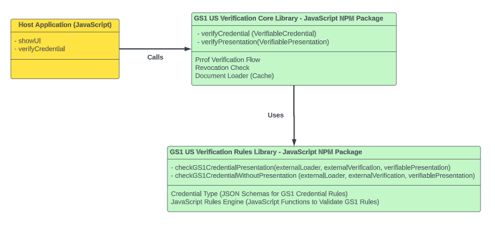

# Overview 
The GS1 US Decentralized Identifier & Verifiable Credentials solution has been created to provide guidance on how to verify Verifiable Credentials (VC) issued for the GS1 Verifiable Credentials ecosystem. 

Currently this solution is built for the [WC3 Verifiable Credentials Data Model 1.1](https://www.w3.org/TR/vc-data-model) and the validation rules defined in the [GS1 Data Model](https://ref.gs1.org/gs1/vc/data-model) to validate the root of trust with GS1 issued credentials.

The GS1 US Verifiable Credentials Verification solution is divided into two libraries. 

- [vc-verifier-core](https://github.com/gs1us-technology/vc-verifier-core): This is the core library for verifying GS1 US Based Verifiable Credentials. This library is the main library to use for verifying VCs. The library will perform proof and revocation checks on all presented VCs. 
- [vc-verifier-rules](https://github.com/gs1us-technology/vc-verifier-rules): This is the rules library for verifying GS1 US Based Verifiable Credentials. This library will validate GS1 based VCs and ensure they follow the level four business rules defined by the GS1 Data Model Document. 

**Notes**: To run the libraries locally you will need to clone both repos into a parent Folder (e.g. gs1-us). The vc-verifier-core library has a dependency on the vc-verifier-rules and requires running a local NPM Install. See the using the library section for more details. 

# Understanding Decentralized Identifiers
## What is a DID
Decentralized identifiers (DIDs) are a new type of identifier that enables verifiable, decentralized digital identity. A DID identifies any subject (e.g., a person, organization, thing, data model, abstract entity, etc.) that the controller of the DID decides that it identifies.

A DID is a simple text string consisting of three parts: 1) the did URI scheme identifier, 2) the identifier for the DID method, and 3) the DID method-specific identifier.


## DID Methods
There are many different types of DID methods. Each method requires a defined method specification, which specifies the precise operations by which DIDs and DID documents are created, resolved, updated, and deactivate.

DID methods are often associated with a particular verifiable data registry (e.g. blockchain) or in cases like did:web use existing web infrastructure to store and support the resolution of DID documents.

The GS1 US Decentralized Identifier & Verifiable Credentials solution currently only supports DID:WEB and DID:KEY based DID Documents. To resolve a DID and get its DID Document you can use the [DID Universal Resolver](https://dev.uniresolver.io). 

The two main DID Documents used by this library are the GS1 Global DID (did:web:id.gs1.org) and the GS1 US DID (did:web:cbpvsvip-vc.gs1us.org).

Here is the DID Document for the GS1 US DID. The key components of the DID Document are the verificationMethod which is contains the public key which is required to verify Verifiable Credentials issued by the GS1 US DID. 
``` JSON
{
  "@context": [
    "https://www.w3.org/ns/did/v1",
    "https://w3id.org/security/suites/ed25519-2020/v1",
    "https://w3id.org/security/suites/x25519-2020/v1",
    "https://w3id.org/security/suites/ed25519-2018/v1"
  ],
  "id": "did:web:cbpvsvip-vc.gs1us.org",
  "verificationMethod": [
    {
      "id": "did:web:cbpvsvip-vc.gs1us.org#z6Mkig1nTEAxna86Pjb71SZdbX3jEdKRqG1krDdKDatiHVxt",
      "type": "Ed25519VerificationKey2020",
      "controller": "did:web:cbpvsvip-vc.gs1us.org",
      "publicKeyMultibase": "z6Mkig1nTEAxna86Pjb71SZdbX3jEdKRqG1krDdKDatiHVxt"
    },
    {
      "id": "did:web:cbpvsvip-vc.gs1us.org#5yYxa2LAQCkNA8BDEkhtgDEoPNeJhHUmsQBvzATvRZrc",
      "type": "Ed25519VerificationKey2018",
      "controller": "did:web:cbpvsvip-vc.gs1us.org",
      "publicKeyBase58": "5yYxa2LAQCkNA8BDEkhtgDEoPNeJhHUmsQBvzATvRZrc"
    }
  ],
  "authentication": [
    "did:web:cbpvsvip-vc.gs1us.org#z6Mkig1nTEAxna86Pjb71SZdbX3jEdKRqG1krDdKDatiHVxt",
    "did:web:cbpvsvip-vc.gs1us.org#5yYxa2LAQCkNA8BDEkhtgDEoPNeJhHUmsQBvzATvRZrc"
  ],
  "assertionMethod": [
    "did:web:cbpvsvip-vc.gs1us.org#z6Mkig1nTEAxna86Pjb71SZdbX3jEdKRqG1krDdKDatiHVxt",
    "did:web:cbpvsvip-vc.gs1us.org#5yYxa2LAQCkNA8BDEkhtgDEoPNeJhHUmsQBvzATvRZrc"
  ],
  "capabilityDelegation": [
    "did:web:cbpvsvip-vc.gs1us.org#z6Mkig1nTEAxna86Pjb71SZdbX3jEdKRqG1krDdKDatiHVxt",
    "did:web:cbpvsvip-vc.gs1us.org#5yYxa2LAQCkNA8BDEkhtgDEoPNeJhHUmsQBvzATvRZrc"
  ],
  "capabilityInvocation": [
    "did:web:cbpvsvip-vc.gs1us.org#z6Mkig1nTEAxna86Pjb71SZdbX3jEdKRqG1krDdKDatiHVxt",
    "did:web:cbpvsvip-vc.gs1us.org#5yYxa2LAQCkNA8BDEkhtgDEoPNeJhHUmsQBvzATvRZrc"
  ],
  "keyAgreement": [
    {
      "id": "did:web:cbpvsvip-vc.gs1us.org#z6LSeSb6DC38Qcwi5H3Rd24PfRL7rAe7wgUJ9feaickQuWx6",
      "type": "X25519KeyAgreementKey2020",
      "controller": "did:web:cbpvsvip-vc.gs1us.org",
      "publicKeyMultibase": "z6LSeSb6DC38Qcwi5H3Rd24PfRL7rAe7wgUJ9feaickQuWx6"
    }
  ],
  "publicKey": [
    {
      "@context": "https://w3id.org/security/v2",
      "id": "did:web:cbpvsvip-vc.gs1us.org#5yYxa2LAQCkNA8BDEkhtgDEoPNeJhHUmsQBvzATvRZrc",
      "type": "Ed25519VerificationKey2018",
      "publicKeyBase58": "5yYxa2LAQCkNA8BDEkhtgDEoPNeJhHUmsQBvzATvRZrc"
    },
    {
      "@context": "https://w3id.org/security/v2",
      "id": "did:web:cbpvsvip-vc.gs1us.org#z6Mkig1nTEAxna86Pjb71SZdbX3jEdKRqG1krDdKDatiHVxt",
      "type": "Ed25519VerificationKey2020",
      "controller": "did:web:cbpvsvip-vc.gs1us.org",
      "publicKeyMultibase": "z6Mkig1nTEAxna86Pjb71SZdbX3jEdKRqG1krDdKDatiHVxt"
    }
  ],
  "service": [
    {
      "id": "did:web:cbpvsvip-vc.gs1us.org#traceability-api",
      "type": [
        "TraceabilityAPI"
      ],
      "serviceEndpoint": "https://vc.cbpsvip.gs1us.org/cbpsvip"
    }
  ]
}
```

When a Verifiable Credential is issued the Public and Private key for the DID Document is used to generate a crypographic proof that is included in the signed Verifiable Credential. This proof is used during verification to identify 
the verificationMethod and assoicated public key to use to validate the Verifiable Credential.

The other main component from the DID Document is the services section. Which defines the different types of services supported by the DID. For the GS1 US DID, we support the Traceability API End Point. 

# Verifiable Credentials

## What is a Credential 

A set of one or more claims made by an issuer. A verifiable credential is a tamper-evident credential that has authorship that can be cryptographically verified. Verifiable credentials can be used to build verifiable presentations, which can also be cryptographically verified.


- Credential Metadata
  - includes the unique ID of the credential, information about the subject or holder, information about the issuer, an expiration date, and the status of the credential
- Claims
  - asserted properties or qualifications about the subject
  - there can one or more claims in a single VC
- Proofs
  - this is the cryptographic signature of the issuer
  - the verifier will used this information to verify the issuer signature and ensure the VC has not be altered.
  
## Example Verifiable Credential
``` JSON
{
  "@context": [
    "https://www.w3.org/2018/credentials/v1",
    "https://ref.gs1.org/gs1/vc/license-context",
    "https://w3id.org/security/suites/ed25519-2020/v1",
    {
      "name": "https://schema.org/name",
      "description": "https://schema.org/description",
      "image": "https://schema.org/image"
    },
    "https://w3id.org/vc-revocation-list-2020/v1"
  ],
  "issuer": "did:web:cbpvsvip-vc.gs1us.org",
  "name": "GS1 Company Prefix License",
  "issuanceDate": "2021-05-11T10:50:36.701Z",
  "id": "http://did-vc.gs1us.org/vc/license/08600057694",
  "type": [
    "VerifiableCredential",
    "GS1CompanyPrefixLicenseCredential"
  ],
  "credentialSubject": {
    "id": "did:key:z6Mkfb3kW3kBP4UGqaBEQoCLBUJjdzuuuPsmdJ2LcPMvUreS/1",
    "organization": {
      "gs1:partyGLN": "0860005769407",
      "gs1:organizationName": "Healthy Tots"
    },
    "extendsCredential": "https://id.gs1.org/vc/license/gs1_prefix/08",
    "licenseValue": "08600057694",
    "alternativeLicenseValue": "8600057694"
  },
  "credentialStatus": {
    "id": "https://cbpvsvip-vc.dev.gs1us.org/status/2c0a1f02-d545-481b-902a-1e919cd706e2/1193",
    "type": "RevocationList2020Status",
    "revocationListIndex": 1193,
    "revocationListCredential": "https://cbpvsvip-vc.dev.gs1us.org/status/2c0a1f02-d545-481b-902a-1e919cd706e2/"
  },
  "proof": {
    "type": "Ed25519Signature2020",
    "created": "2023-05-22T16:55:59Z",
    "verificationMethod": "did:web:cbpvsvip-vc.gs1us.org#z6Mkig1nTEAxna86Pjb71SZdbX3jEdKRqG1krDdKDatiHVxt",
    "proofPurpose": "assertionMethod",
    "proofValue": "zfWTiZ9CRLJBUUHRFa82adMZFwiAvYCsTwRjX7JaTpUnVuCTj44f9ErSGbTBWezv89MyKQ3jTLFgWUbUvB6nuJCN"
  }
}
```

# Library Runtime

The library is a JavaScript based NPM package that is built on top of the WC3 standards libraries provided by Digital Bazaar. The library can be consumed directly using the library index.js file or using the bundled and minified version of the library. 

The library requires the following environment:
- Node - v18.16.1+
- NPM - 9.5.1+

# Repo Folders
- `public`: Sample and Test Credentials used by the library. 
- `src\contents`: JSON-LD and DID Documents required by the library including the standard WC3 JSON-LD files, the GS1 Data Model JSON-LD files, and other dependent 
- `src\lib`: The main code for the GS1 US vc-verifier-core JavaScript library.
 - `index.ts`: Test Suite for testing the library

# Running the Library Locally 
To use the GS1 US Decentralized Identifier & Verifiable Credentials solution you will need to clone both the [vc-verifier-core](https://github.com/gs1us-technology/vc-verifier-core) and [vc-verifier-rules](https://github.com/gs1us-technology/vc-verifier-rules) libraries. 

After cloning both libraries open the `vc-verifier-rules` library and perform the following steps from the top folder for vc-verifier-rules.
``` 
npm install
npm run dev
``` 

The  `npm run dev` command will compile the library into it's dist folder. This is a prerequisite before running the `vc-verifier-core` library. Now, load the `vc-verifier-core` library and preform the following steps.

``` 
npm install
npm install  ../vc-verifier-rules
npm run dev
``` 
Note: 'npm install ../vc-verifier-rules' is required for loading the `vc-verifier-rules` project so that the `vc-verifier-core`

To use the GS1 US Library add a `require` reference to the `index.js` file in the library. This will allow you to verify GS1 credentials. 

Now that both libraries are setup and running locally from the top level command line for `vc-verifier-core` running the following to execute the libraries test suite.

``` 
node .
``` 

# Using the Library
To use the GS1 US Decentralized Identifier & Verifiable Credentials core library in your own solution. Do a local 'npm install ../vc-verifier-core'. This will install the library and its depdeencies into your local node_modules folder. 



## Referencing the Library 
Add the following to reference the library your local code.
``` typescript
import { verificationErrorCode, 
        verifyCredential,
        verifyPresentation} 
    // @ts-ignore
    from '@gs1us/vc-verifier-core';
``` 
## Library API
The library includes two methods for verifying credentials.
- `verifyPresentation` Is the main method and should be used when you have a signed presentation that contains the required GS1 credentials.
- `verifyCredential` Is an additional method that can be called when you only have an array of raw credentials. Internally this method will generate an unsigned presentation to verify the credentials.


## Code Example
Here is an example of calling the `verifyPresentation` method in the library. This will verify all the verifiable credentials included in the presentation. After the proof and revocation checks are performed on the verifiable credentials any GS1 credential's includes will be verified using the vc-verifier-rules library.

``` typescript

const testPresentation = getTestPresentation("company-prefix-organization-key-08.json");
const vcResult: verificationResult = await verifyPresentation(testPresentation);

if (vcResult.verified === true) {
   console.log("Success");
} else {
  console.log(JSON.stringify(vcResult, null, 4));
```

## Library Output 
TBD

## Revocation Check 
TBD


